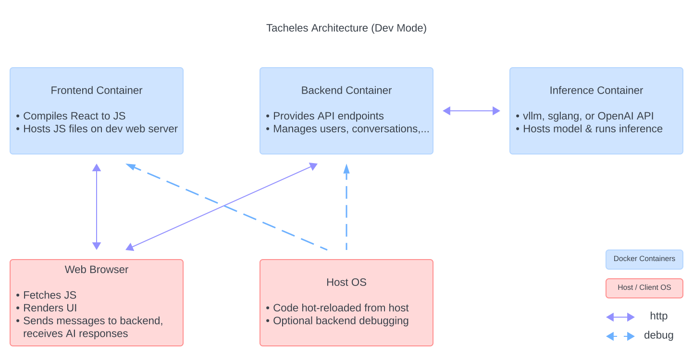
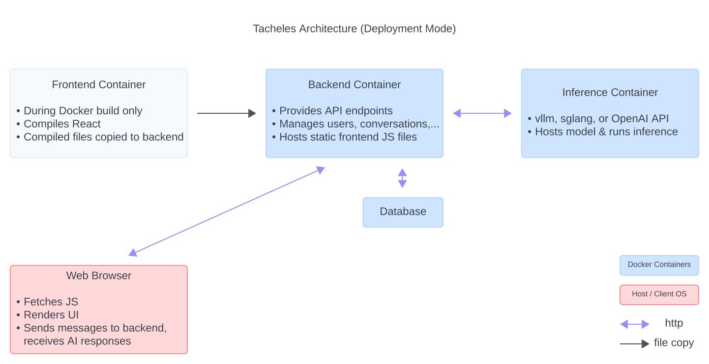

# tacheles Documentation

## Table of Contents

1. [Introduction](#introduction)
2. [Architecture Overview](#architecture-overview)
   - [Frontend](#frontend)
   - [Backend](#backend)
   - [Inference Engines](#inference-engines)
   - [Database](#database)
3. [Extending and Customizing tacheles](#extending-and-customizing-tacheles)
   - [Development Environment Setup](#development-environment-setup)
   - [Adding New Features](#adding-new-features)
4. [Deploying tacheles Applications](#deploying-tacheles-applications)
   - [Small Deployments](#small-deployments)
   - [Scaling Up](#scaling-up-to-big-deployments)
5. [Conclusion](#conclusion)

## Introduction

tacheles is a comprehensive blueprint for building LLM chat applications. It provides a solid foundation for developers to create sophisticated LLM-powered chat interfaces or integrate chat capabilities into existing systems. The project consists of a React frontend, a FastAPI backend, and various inference engine options, all orchestrated using Docker and Docker Compose.

## Architecture Overview

The tacheles architecture is designed to be modular, scalable, and easily extensible. It comprises three main components: the frontend, the backend, and the inference engine. Additionally the backend uses a database, either within its own container, or in another container or external service. How these components work together can vary:



In development mode, the frontend container hosts the compiled React frontend on a dev web server running on `http://localhost:3000/`. Once the frontend is loaded from there, the user's browser communicates directly with the backend by sending API requests to `http://localhost:8001`, which is the exposed port of the backend container. The backend processes these requests, interacts with the inference engine and the database, and sends responses back to the frontend.

To start tacheles in development mode, use `MODEL=username/model docker compose -f docker-compose.dev.yaml up`. Alternatively you can also use `docker-compose.dev.mock.yaml` - this does all of the above, but additionally starts tacheles with a _mocked_ inference API server. This allows development of the frontend and backend, without having to run an actual LLM.



In deployment mode, the frontend is typically served as a static file bundle instead. In the configuration that comes with tacheles, this static file bundle is served by the backend FastAPI server on port 80, eliminating the need for a separate static file host container. The user's browser communicates with the backend server both to load the static frontend files, as well as for subsequent API calls. However, many other deployment architectures are possible, which we discuss toward the end of this document.

To start tacheles in deployment mode, use `MODEL=username/model docker compose -f docker-compose.yaml up`.

### Main Components Overview

#### Frontend

The frontend of tacheles is built using React and is located in the `frontend` directory. Two main components are worth noting: One, `ChatInterface` provides a basic interface showing prior messages in a conversation (using the `MessageList` component) and allowing the user to send new messages (using the `UserInput` component). This component also implements streaming responses on the client side. Two, `ChatInterfaceWithConversationList` wraps around this basic interface and provides a sidebar with a menu showing all previous conversations and allows the user to switch between them. (But note that this is optional - `ChatInterface` also functions standalone, and we show an example of this in `AppWithoutConversationList`.)

For those unfamiliar with React, these components are not directly executable themselves, but are compiled by React into Javascript and HTML that can be run on a client web browser. During development, React runs its own web server from which it serves these compiled files, so that code changes can be hot-reloaded - this is why we run a frontend docker container during development. For deployment, this compilation is done once ahead of time, and the compiled files are served by a production web server. As one option for doing so, we could serve them as static files from the backend FastAPI server, but this is just one option (see also the section on deployment).

#### Backend

The backend of tacheles is built using FastAPI and is located in the `backend` directory. It acts as the intermediary between the frontend and the inference engine, handling API requests, managing the database, and processing chat messages. For instance, the inference API (be it vllm, sglang or OpenAI) doesn't remember prior messages in a conversation - when the browser sends a new user message, the backend retrieves the conversation history from its database, and ensures we feed the correct sequence of messages into the LLM. The backend is written using [FastAPI](https://fastapi.tiangolo.com/) and [SQLModel](https://sqlmodel.tiangolo.com/). Together, these provide a very easy way to define API endpoints and interact with a database, as a single class definition can be used to define a database table and relationships, as well as API endpoint arguments and return types.

For extensibility, the backend is split into multiple files, the main two of note are `api/routes.py` which defines all API endpoints, and `models/models.py` which defines database tables (and thus also API argument and return types). Most API routes are very simple thanks to the FastAPI & SQLModel magic, except `api/routes.py:chat()` uses some slightly non-trivial code to enable streaming responses. `tacheles_backend.py` pulls these two together, and `models/database.py` and `utils/logging.py` contain utility functions for database and logging setup (which are mostly stubs, but separated out for future development).

#### Inference Engines

tacheles supports multiple inference engines for running the language model and generating responses. The inference engines are hosted in separate Docker containers and expose an OpenAI-compatible API for seamless integration with the backend.

The supported inference engines include:

- [vllm](https://github.com/vllm-project/vllm): A high-performance inference engine for running large language models. It provides an optimized runtime environment for efficient inference.

- [sglang](https://github.com/sgl-project/sglang): A flexible inference engine that supports multi-modal models and fast JSON decoding, and radix attention for even faster inference.

- [Mock API](https://github.com/polly3d/mockai): For development purposes, tacheles includes a "mock" inference API option, that allows local development without having to run an actual LLM.

- Commercial APIs: tacheles can also integrate with commercial API such as the official OpenAI API, instead of locally hosted models.

The "default" `docker-compose.yaml` and `docker-compose.dev.yaml` configurations use sglang, or optionally vllm (see inside the files). If you'd like to use a commercial API, use the `...openai.yaml` files. You can change the `INFERENCE_API_URI` variable in those files to use an API different from the standard OpenAI endpoints. The mock API is used only for development, through the `docker-compose.dev.mock.yaml` configuration.

#### Database

tacheles uses an SQL database to store conversation history and user information. In development docker-compose configurations this is set to a local sqlite database for simplicity. Deployment docker-compose files include a mysql database container, but this could be replaced by any other supported SQL database container, or by an externally hosted database.

## Extending and Customizing tacheles

tacheles is designed to be easily extensible and customizable to fit various use cases and requirements. Let's first explore how to set up a development environment that makes working with tacheles easy, and then how to add new features, modify the frontend and backend, and write tests.

### Development Environment Setup

#### Dev Mode Containers & Debugging

tacheles is built to make developing new features as easy as possible. In development mode, both the frontend and backend are hot-reloaded from the host OS, so you don't need to restart docker containers when you make changes. The `docker-compose.dev.mock.yaml` setup additionally allows development without loading a real LLM, and without a GPU or other hardware capable of doing so!

Both development setups also allow debugging the backend from the host OS on port `5678`. In order to connect to this from VS Code, add the following configuration to your `launch.json` file:

```json
{
  "configurations": [
    {
      "name": "Python: Debug tacheles backend",
      "type": "debugpy",
      "request": "attach",
      "connect": { "host": "localhost", "port": 5678 },
      "pathMappings": [
        {
          "localRoot": "${workspaceFolder}/backend",
          "remoteRoot": "/app"
        }
      ],
      "justMyCode": true
    }
  ]
}
```

Then, spin up the containers, and select the new configuration in the debugging tab, and select `Start Debugging`. If you run into any issues that crash the backend before you're able to connect, add `--wait-for-client` to the entrypoint in `backend/Dockerfile.dev` between `debugpy` and `--listen`. The backend debugger will then wait for a connection before actually starting the backend server. (Note, however, that this means you _have to_ connect a debugger, or the backend will never start - this is why the option is not enabled by default.)

You could similarly debug the inference engine (i.e., vllm or sglang), but this should rarely be necessary. If you do find yourself in need of this, check the commented out entrypoint in `docker-compose.dev.yaml` for how to.

#### Formatting, Testing, and GitHub Actions

tacheles is also set up to enable automatic formatting, linting and testing, both locally and through GitHub Actions, to help maintain code quality over time.

To run these locally, use `black .`, `flake8 .` and `pytest .` inside the backend directory to format, lint and test the backend, respectively. Similarly, run `npm run format`, `npm run lint` and `npm run test` inside the frontend directory to format, lint and test the frontend. If you use VS Code, the provided configuration file should also set these up to happen automatically in VS Code.

Additionally, there are end-to-end tests that test the frontend against a real running backend and the mock inference engine. To run these locally, run `REACT_APP_BACKEND_URL=http://localhost:8001 npm run test:e2e`. You must have the `docker-compose.dev.mock.yaml` configuration up and running for this to work.

Finally, tacheles ships with GitHub Action configurations that can run all of these on GitHub. By default, these actions are configured to be run manually, as well as on pull requests on the main branch. You can adjust this in `.github/workflows`.

### Adding New Features

tacheles is meant as a foundation for building specialized LLM apps, and was built to make it easy to extend and add new features. Generally to do so, you would add or modify frontend components, and backend API routes (and possibly database models).

#### Modifying the Frontend

The frontend currently provides four main components that work together to implement a basic chat interface: `MessageList`, `UserInput`, `ChatInterface` and `ChatInterfaceWithConversationList`. These are modular and could each be used standalone - for instance, `MessageList` by itself could be used to display a read-only conversation that the user cannot respond to. `ChatInterface` by itself could be used to implement a single-conversation interface, without the ability to go back to earlier conversations. We provide an example of implementing this in `AppWithoutConversationList.js`, and this can be enabled by commenting out a line in `index.js`.

When modifying the frontend you may wish to use these components as starting points and as examples. For instance, `ChatInterfaceWithMessageList` is a good example of how to add an additional feature to the more basic `ChatInterface`.

#### Modifying the Backend

Extending the backend will typically involve two types of additions: API routes, and database models. Database models in SQLModel are essentially Python dataclasses with a few extra annotations, which SQLModel converts into both database tables as well as Pydantic models for automatic data validation. Using these, writing API routes is often trivially easy. For instance, check out `backend/api/routes.py:get_conversations()` which implements an API endpoint to list all conversations for a user in just two lines.

#### Writing Tests

tacheles includes tests for the frontend and backend, and you might wish to add tests for your own features as well.

Frontend tests are located in the `frontend/src/__tests__` directory. They use the `@testing-library/react` library to render components, simulate user interactions, and make assertions. Most of these take the form of "render a component, find a button in the DOM and click it, then check that certain components or text fragments are present in the DOM afterwards", and should be easy to adapt to new components. Calls to the backend API are mocked.

Backend tests are located in the `backend/tests` directory. They use the `pytest` testing framework and `fastapi.testclient.TestClient` to test the API endpoints and database operations. Here in turn, calls to the inference API are mocked.

When adding new components or features, use these as templates for adding your own tests. Additionally, there are end-to-end tests in `frontend/src/__tests__e2e__` which test the entire application end-to-end using the mock inference container. These follow similar patterns as the frontend integration tests, and should be easy to extend to cover new functionality.

## Deploying tacheles Applications

The included `docker-compose.yaml` and `docker-compose.openai.yaml` configurations are one relatively straightforward way to deploy tacheles. They serve the compiled frontend from the backend FastAPI server, and use a mysql container as a database. This is only one of many possible configurations, and you may wish to consider other options.

### Small Deployments

If you use an external inference API (e.g., OpenAI) as well as an externally hosted database (e.g., Amazon RDS) you could host tacheles from a single web server / docker container, and even on the free tier of many hosting services. You have two options for doing so:

- In a **dockerized** setup, you could simply build and run only the (deployment) backend container, and point it to inference API and database using environment variables `DATABASE_URL` and `INFERENCE_API_URI` (or leave this unset for the OpenAI API). This will automatically build the frontend and copy it into the backend container.
- If you prefer or require a **non-dockerized** setup, you could host the backend on a host-OS Python runtime. In this case, you would need to manually compile the frontend using `npm run build`, and then copy the contents of `frontend/build` to your web server. You could then set the `HOST_FRONTEND_PATH` environment variable to tell the backend to serve the compiled frontend, or you could host the frontend through other means.

### Scaling Up to Big Deployments

In the opposite direction, you may wish to use Kubernetes or a similar orchestration system to scale tacheles up to large deployments. A full discussion of this is beyond the scope of this document. However, we note several considerations:

- The default configuration of hosting the frontend through the backend container is simple and convenient, but may not be as fast as a dedicated static web server such as `nginx`.
  - A common pattern is to then also use the frontend web server as a proxy for the backend API requests. If you choose to do this, make sure your proxy supports and is configured for server-sent events (SSE), or you will lose the ability to stream responses.
  - If you instead choose to host the frontend separately from the backend (i.e., under a different URL), you must set the `REACT_APP_BACKEND_URL` when compiling the frontend to point it to the correct backend URL.
- The backend (in its current state) is stateless, and could be scaled horizontally, even without sticky sessions. (All state is stored in the database.)
- Both vllm and sglang, however, or only partly stateless: For optimal performance, subsequent requests in one conversation should ideally be directed to the same inference replica for best performance.

## Conclusion

I hope this document, and tacheles, is useful to you. If there is anything you found missing, let me know via email or through a GitHub issue.
