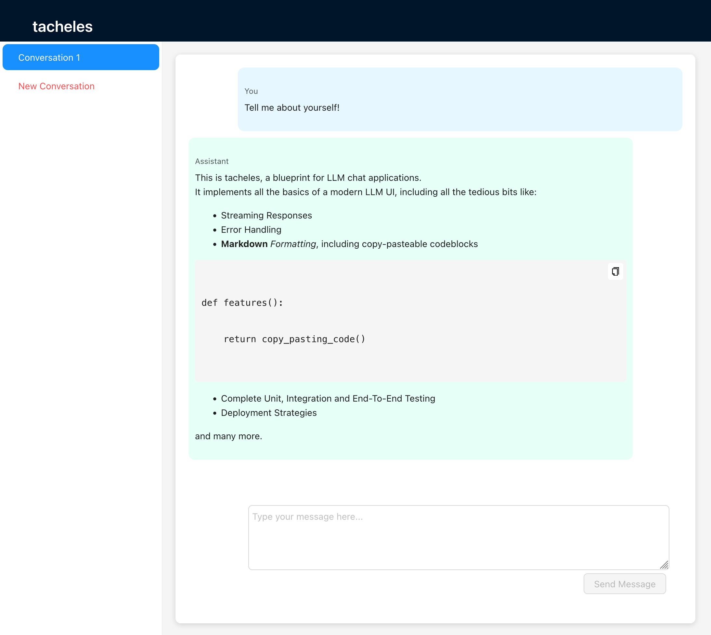

# tacheles

> "Tacheles: German, borrowed from Yiddish: A conversation about an essential or difficult topic, straight talk"

tacheles is a lightweight, open-source blueprint for building powerful and scalable language model (LLM) chat applications. It provides a an end-to-end implementation of LLM chat together with comprehensive scaffolding for development and deployment.



## Features

tacheles includes a complete end-to-end LLM chat interface. It implements all the basic functionality, including a few features that are slightly non-trivial to implement:

- **Complete UI & Backend**: including tracking conversations, switching between conversations, and a modern, responsive UI.
- **State-of-the-Art Inference Engines**: tacheles includes support for inference through both sglang and vllm, as well as commercial APIs such as OpenAI.
- **Streaming Output**: LLM responses are streamed token by token, and aborted requests are handled gracefully.
- **Markdown Rendering**: Messages support markdown rendering and copy-pasting rendered code. Partial markdown is rendered while responses are streaming.
- **Detailed Documentation**: All of tacheles is documented and commented in detail, to allow even novice developers to get started quickly.

Additionally, tacheles includes all the scaffolding around the core functionality:

- **Dockerized Setup**: The entire application is dockerized, and includes example configurations for a variety of deployment scenarios.
- **Complete Development Environment**: tacheles provides a completely set up development environment through docker, including hot-reloading code changes from the host OS, debugging through docker, and a mock inference API so no GPU is needed for development.
- **Tests**: The project includes unit, integration and end-to-end tests of the entire application.
- **GitHub Actions**: Additionally, GitHub actions are set up for formatting, linting and testing.

## Who is tacheles for?

Anyone who's wanted to build LLM application, but didn't know where to start! tacheles is meant to provide a solid foundation on which you can build custom application, and is designed with extensibility, scalability and easy development in mind. tacheles could be for you if

- you're an ML practitioner and know how LLMs work, but aren't as familiar with web and frontend technologies (all code in tacheles is simple, and copiously commented, to help get you started),
- you've been building prototypes using ML-focused tools such as gradio but would like to scale them up or integrate them with other projects (tacheles components are built to be modular and easily integrated with existing React or FastAPI apps),
- you know individual technologies such as React or FastAPI, but not how to put them together into a complete project (tacheles ships with example docker files and documentation on architecture),
- you know how to build a project like this, but not how to deploy it or scale it up to large numbers of users (tacheles is built with scalability in mind and the documentation has some pointers to get you started),
- you know how to build this, but you hate starting from scratch or setting up things like tests and CI/CD (tacheles does all the tedious bits for you),
- you want to build something highly specialized and find existing LLM chat UI projects too complex for your needs (tacheles is intentionally lean with just a few hundred lines of code at its core), or
- you want to learn how to build a modern and scalable web app from scratch (tacheles provides ample documentation and commentary throughout its code and is meant in part also as an educational project).

## What is tacheles **not**?

tacheles is _not_ a full-featured app by itself. It is meant to be a starting point for you to build your own specialized applications with, rather than an off-the-shelf replacement of existing general-purpose LLM chat apps.

## Getting Started

To get started with tacheles, follow these steps:

1. Clone the repository: `git clone https://github.com/mgerstgrasser/tacheles.git`
2. Navigate to the project directory: `cd tacheles`
   - If you have a GPU and want to run local inference, run `MODEL=username/model HF_TOKEN=your_token docker-compose -f docker-compose.dev.yaml up --build`.
   - If you have money and want to run inference through OpenAI, run `MODEL=gpt-3.5-turbo OPENAI_API_KEY=sk-... docker-compose -f docker-compose.dev.openai.yaml up --build`.
   - If you have neither and want to just develop without a real LLM, run `docker-compose -f docker-compose.dev.mock.yaml up --build`.
3. Open your browser and visit `http://localhost:3000` to access the chat interface.

Then, head over to the [documentation](DOCUMENTATION.md) for more detailed information on usage, architecture, development, debugging, and production deployment.

## License

tacheles is open-source software licensed under the [Apache License](LICENSE).

If you find this useful in academic work, consider citing this repository:

```bibtex
@misc{gerstgrasser2024tacheles,
  author = {Matthias Gerstgrasser},
  title = {tacheles: a scalable foundation for LLM chat applications},
  year = {2024},
  publisher = {GitHub},
  journal = {GitHub repository},
  howpublished = {\url{https://github.com/mgerstgrasser/tacheles}}
}
```
